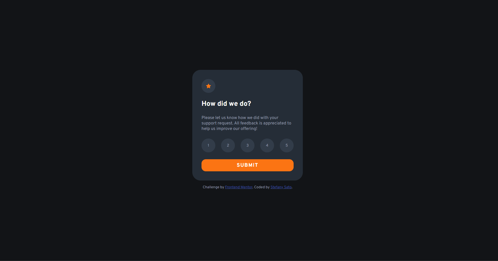

# Frontend Mentor - Interactive rating component solution

This is a solution to the [Interactive rating component challenge on Frontend Mentor](https://www.frontendmentor.io/challenges/interactive-rating-component-koxpeBUmI).

### The challenge

Users should be able to:

- View the optimal layout for the app depending on their device's screen size
- See hover states for all interactive elements on the page
- Select and submit a number rating
- See the "Thank you" card state after submitting a rating

### Screenshot

### Links

- Solution URL: [Solution - Frontend Mentor](https://your-solution-url.com)
- Live Site URL: [Add live site URL here](http://webdevste.github.io/interactive-rating-component)

### Built with

- Semantic HTML5 markup
- CSS custom properties
- Flexbox
- JavaScript

## Author

- Website - [GitHub](https://github.com/stefanysato)
- Frontend Mentor - [@stefanysato](https://www.frontendmentor.io/profile/stefanysato)